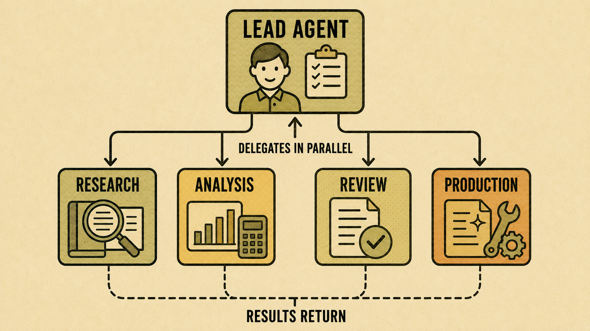

- [Chapter 3.10 Build or Use a Workspace Agent](#chapter-310-build-or-use-a-workspace-agent)
  - [Divide a large assignment into distinct responsibilities](#divide-a-large-assignment-into-distinct-responsibilities)
  - [Run independent work in parallel](#run-independent-work-in-parallel)
  - [Supply each agent with the right context](#supply-each-agent-with-the-right-context)
  - [Compare and synthesize the results](#compare-and-synthesize-the-results)
  - [Understand workspace agents](#understand-workspace-agents)
  - [Try it now](#try-it-now)
    - [Check the result](#check-the-result)

# Chapter 3.10 Build or Use a Workspace Agent

*Chapter 3.1* reserved subagents for work that genuinely splits into separate pieces. This chapter shows you how that works in practice, using workspace agents in an organization-managed account or a lead agent that delegates to specialist subagents.

> **Watch out**: This chapter requires an organization-managed workspace which is why it is an optional online-only chapter.

## Divide a large assignment into distinct responsibilities

Before delegating anything, break the assignment into parts that do not depend on each other's exact wording, only on their finished results. A market report might split into research, competitor analysis, and drafting. Each part can proceed on its own, then combine at the end.

If a task cannot be described without constant back-and-forth between its parts, it is not ready to split. Keep it as one connected piece of work instead.

> **Watch out**: Splitting a task too early often costs more time than it saves, because you end up correcting misunderstandings between the parts. Only split work once each part has a clear, independent goal.

## Run independent work in parallel

Once the assignment is divided, each part can run at the same time instead of one after another. This is the main advantage of delegating to specialists: total time drops because the parts do not wait for each other.

*Figure 3.10A: A lead agent can delegate separate parts of a task to specialist subagents, then combine their results.*

## Supply each agent with the right context

Each specialist needs enough context to do its part well, but not the whole assignment's full history. Give the research specialist the question and the sources to check. Give the drafting specialist the research findings and the target audience. Avoid handing every specialist the same unfiltered pile of information, since that slows them down without helping:
1.	Identify the exact information each specialist needs to complete its part.
2.	Provide that information directly when assigning the work.
3.	State the expected output format for each part.
4.	Note any deadline or priority order among the parts.

## Compare and synthesize the results

When the parts finish, review each one before combining them. Check for contradictions between parts, since specialists working independently can reach different conclusions from the same starting point.

[FIGURE 3.10B: Screenshot] Product/Screen: ChatGPT Work or a workspace agent view showing several active work threads and their status. Crop: The thread list with three or four entries, each showing a short label and a status such as running or complete. Labels: Numbered callouts on the thread list, the status column, and the option to open one thread's detail. Teaching purpose: Show readers what delegated, parallel work looks like while it is in progress, not only after it finishes. 

*Figure 3.10B: Several specialist threads can run at once. Check each one's status before combining the results.*

Check:
1.	Open each completed part and check it against the goal you gave it.
2.	Note any disagreement or gap between parts.
3.	Ask ChatGPT to resolve a contradiction or fill a gap before producing the final combined result.
4.	Review the combined result as a whole, not only its individual pieces.

> **Good practice**: Read the combined result the way you would read a report written by several colleagues. Look for a consistent voice, consistent facts, and no repeated sections.

## Understand workspace agents

A workspace agent is built and maintained by an organization for a Business, Enterprise, Edu, or Teachers account. It follows instructions and access rules set centrally, rather than by one person. Think of it as an evolution of a Custom GPT, built for organizational use rather than personal use, with permissions and updates managed by the organization.

If you work in an organization-managed workspace, check whether a workspace agent already exists for your kind of task before building your own GPT or subagent workflow from scratch.

## Try it now

Take a task you marked as a candidate for subagents in *Chapter 3.1*. Write down how you would split it into two or three independent parts, what context each part needs, and how you would check the combined result.

### Check the result

- Does each part of your split task have a clear, independent goal?
- Did you plan what context each specialist needs, rather than giving all of them everything?
- Do you have a specific way to check the combined result for contradictions?

Subagents and workspace agents suit assignments large enough to divide into parts.
