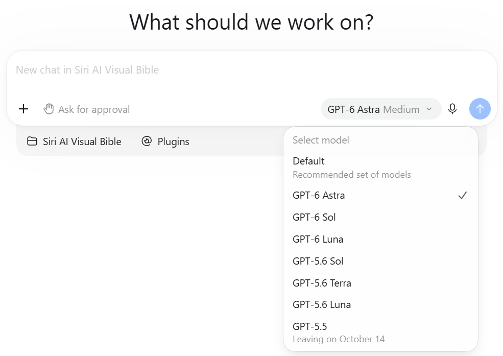
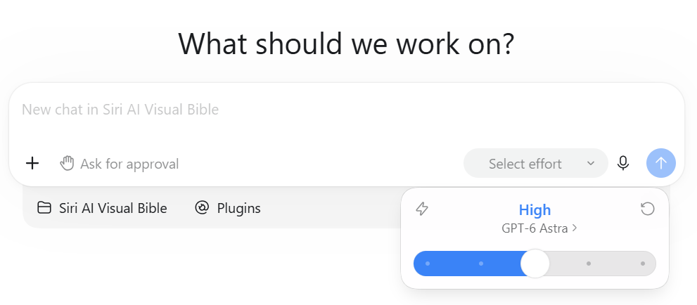

- [ChatGPT model release timeline: GPT-5 to GPT-6](#chatgpt-model-release-timeline-gpt-5-to-gpt-6)
- [Interface and feature changes since publication](#interface-and-feature-changes-since-publication)
  - [Book 1 Ask ChatGPT](#book-1-ask-chatgpt)
- [Book 2 Create Real Work Results](#book-2-create-real-work-results)
- [Book 3 Automate Recurring Tasks](#book-3-automate-recurring-tasks)
- [Book 4 Advanced Your Career and Income](#book-4-advanced-your-career-and-income)

> Last checked: 26 September 2026

ChatGPT changes often. A menu can move, a feature can leave preview status, or a plan can change its price after this book goes to print. This page exists so a printed screenshot never leaves you stuck.

# ChatGPT model release timeline: GPT-5 to GPT-6

A chronological timeline of OpenAI's major and minor ChatGPT model releases, from GPT-5 in August 2025 through GPT-6 in September 2026.

| Date | Model | What changed |
|---|---|---|
| August 7, 2025 | **GPT-5** | Replaced GPT-4/GPT-4o as OpenAI's flagship. Introduced a unified system that routes each request between a fast model and a deeper "GPT-5 thinking" reasoning model. Lower hallucination rates, stronger math/coding/finance benchmarks, and early agentic features (autonomous desktop and browser use). |
| November 12, 2025 | **GPT-5.1** | Added eight selectable personality options and a warmer default tone, plus GPT-5.1 Instant and GPT-5.1 Thinking modes. Specialized coding variants GPT-5.1-Codex-Mini and GPT-5.1-Codex-Max shipped alongside it; a further round of related models followed on November 19, 2025. |
| December 11, 2025 | **GPT-5.2** | A three-model family (GPT-5.2, GPT-5.2 thinking, GPT-5.2 Pro) aimed more at power users, developers, and enterprise agents than casual chat. Stronger at spreadsheets, financial modeling, and multi-step project work. Shipped with a GPT-5.2-Codex coding variant. |
| February 5, 2026 | **GPT-5.3-Codex** | A specialized coding model, positioned as a competitor to Claude Opus 4.6, focused on code generation, repository search, running terminal commands, and debugging. Initially limited to ChatGPT Pro subscribers. |
| February 12, 2026 | **GPT-5.3-Codex-Spark** | A smaller, faster variant of GPT-5.3-Codex. |
| March 5, 2026 | **GPT-5.3 Instant** | A smaller general-purpose model released the same day as GPT-5.4, positioned beneath it in the lineup.  |
| March 5, 2026 | **GPT-5.4** | The first mainline GPT-5-family model with native computer use, a million-token context option, and tool search. Released alongside the smaller GPT-5.3 Instant model. |
| April 23, 2026 | **GPT-5.5** | Released across both ChatGPT and Codex. GPT-5.5 Instant became ChatGPT's default model on May 5, 2026. |
| July 9, 2026 | **GPT-5.6** | Introduced named capability tiers ("Sol," "Terra," and "Luna") in place of the earlier Instant/Thinking naming pattern. |
| August 6, 2026 | **GPT-5.6 update** | Refreshed the Sol tier with more reliable facts, more focused answers, and a slider for how much thinking effort ChatGPT uses. Luna became the default model for Free and Go users, with unlimited text and a new Think button. Both replaced GPT-5.5 Instant. |
| September 3-4, 2026 | **GPT-6 Astra** | Announced as a "generational leap," with major gains in software engineering, professional document and slide creation, and mathematical reasoning. |
| 8 Sep 2026 | **ChatGPT Images 2.5** | Image generation UI changed (Sketch, comment-based edits, templates). |
| 22 Sep 2026 | **GPT-6 Sol**, **GPT-6 Luna** | New model choices in ChatGPT Work and Codex. Luna reaches Free and Go users in the desktop app. Chat is not yet included. No Terra yet. |

**Sources**
- [GPT-6 Astra: A new generation of intelligence - OpenAI](https://openai.com/index/gpt-6-astra/)
- [Model Release Notes - OpenAI Help Center](https://help.openai.com/en/articles/9624314-model-release-notes)
- [ChatGPT release notes, OpenAI Help Center](https://help.openai.com/en/articles/6825453-chatgpt-release-notes)
- [Model Release Notes, OpenAI Help Center](https://help.openai.com/en/articles/9624314-model-release-notes)
- [Introducing GPT-6 Sol and Luna, OpenAI](https://openai.com/index/introducing-gpt-6-sol-and-luna/)
- [Introducing ChatGPT Images 2.5, OpenAI](https://openai.com/index/introducing-chatgpt-images-2-5/)

# Interface and feature changes since publication

| Date | Change | Label |
|---|---|---|
| 8 Sep 2026 | Images 2.5 adds Sketch, templates, comment-based edits | Interface change |
| 9 Sep 2026 | GPT-5.6 and GPT-6 Astra added to Voice for paid users. Daily limits restructured (Go 3 hours with mini, Plus 3 hours, Pro $100 tier 15 hours, Pro $200 tier unlimited) | Plan and pricing change |
| 11 Sep 2026 | Custom GPTs announced for retirement, with migration to plugins | Feature availability |
| 14 Sep 2026 | Automatic switching from Instant to Thinking retired for Plus and Pro | Interface change |
| 17 Sep 2026 | ChatGPT for Word launched on all plans | Feature availability |
| 21 Sep 2026 | Privacy Center launched for Free, Go, Plus, and Pro | Interface change |
| 21 Sep 2026 | Experian credit report integration (Finances) for US Plus and Pro | Region and account difference |
| 22 Sep 2026 | Interactive flashcards added on mobile and web | Feature availability |
| 23 Sep 2026 | Voice now works with plugins and in Work | Feature availability |
| 14 Aug 2026 | Think available to Free and Go | Plan and pricing change |
| 14 Aug 2026 | Linux desktop app in public preview | Feature availability |

## Book 1 Ask ChatGPT

Left navigation bar has icons for:
- **Home**
- **Scheduled**
- **Library**
- **Images**
- **Plugins**
- **...** (more that leads to **Projects**, **Sites**, **Maps**, **GPTs**)

Account menu in ChatGPT app:

Advanced model picker:

Slider model picker:

# Book 2 Create Real Work Results

# Book 3 Automate Recurring Tasks

# Book 4 Advanced Your Career and Income
